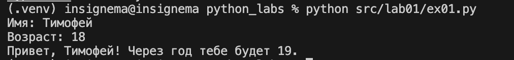
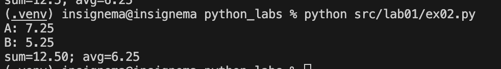
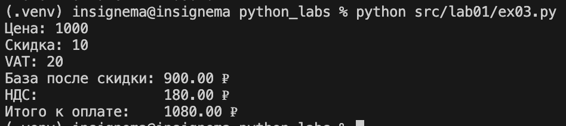
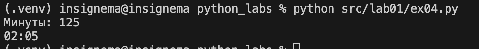
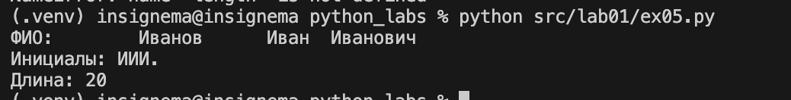

# python_labs

## Лабораторная работа 1

### Задание 1
```python
name = input('Имя: ')
age = int(input('Возраст: '))

print(f'Привет, {name}! Через год тебе будет {age +1}.')
```


### Задание 2
```python
a = float(input('A: ').replace(',', '.'))
b = float(input('B: ').replace(',', '.'))
print(f'sum={a+b:.2f}; avg={(a+b)/2:.2f}')
```


### Задание 3
```python
price = int(input('Цена: '))
discount = float(input('Скидка: '))
vat = float(input('VAT: '))

base = price * (1 - discount/100)
vat_amount = base * (vat/100)
total = base + vat_amount

print(f'База после скидки: {base:.02f} ₽ \nНДС:               {vat_amount:.02f} ₽\nИтого к оплате:    {base + vat_amount:.02f} ₽')
```


### Задание 4
```python
time = int(input("Минуты: "))
print(f'{(time//60)}:{(time%60):02d}')
```


### Задание 5
```python
import re

def get_initials(name):
    words = name.split()
    initials = ""
    for word in words:
        if word:
            initials += word[0].upper()
    return initials

name = str(input('ФИО: '))
name = re.sub(r'\s+', ' ', name).strip()
print(f'Инициалы: {get_initials(name)}.')
print(f'Длина: {len(name)}')

```


