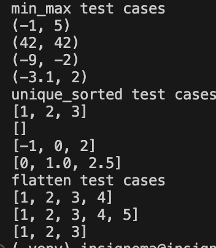
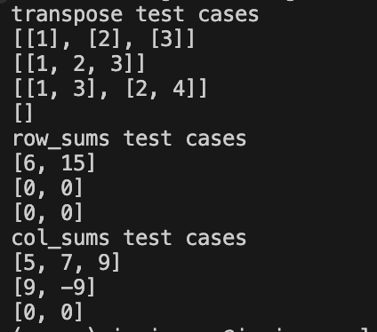
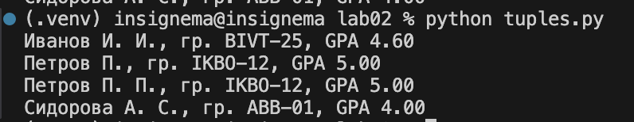

# python_labs

## Лабораторная работа 2

### Задание A
```python
def min_max(nums: list[float | int]) -> tuple[float | int, float | int]:
    if len(nums) == 0:
        raise ValueError
    return(min(nums), max(nums))

def unique_sorted(nums: list[float | int]) -> list[float | int]:
    return(list(sorted(set(nums))))

def flatten(mat: list[list | tuple]) -> list:
    res = []
    for i in mat:
        if type(i) in (list, tuple):
            for j in i:
                res.append(j)
        else:
            raise TypeError
    return(res)
```


### Задание B
```python
def is_rectangular(mat: list[list]) -> bool:
    if not mat:
        return True
    rectangle_length = len(mat[0])
    for i in mat:
        if len(i) != rectangle_length:
            return False
    return True


def transpose(mat: list[list[float | int]]) -> list[list]:
    res = []
    if not is_rectangular(mat):
        raise ValueError
    if not mat:
        return mat
    for i in range(len(mat[0])):
        prog = []
        for j in range(len(mat)):
            prog.append(mat[j][i])
        res.append(prog)
    
    return res

def row_sums(mat: list[list[float | int]]) -> list[float]:
    res = []
    if not is_rectangular(mat):
        raise ValueError
    for i in mat:
        res.append(sum(i))
    return res

def col_sums(mat: list[list[float | int]]) -> list[float]:
    res = []
    mat = transpose(mat)
    if not is_rectangular(mat):
        raise ValueError
    for i in mat:
        res.append(sum(i))
    return res
```


### Задание C
```python
def format_record(rec: tuple[str, str, float]) -> str:
    fio = rec[0]
    group = rec[1]
    gpa = rec[2]

    if fio == "":
        raise ValueError
    if group == "":
        raise ValueError
    if type(gpa) != float:
        raise TypeError
    
    fio = fio.split()
    if len(fio) == 3:
        fio[0] = fio[0][0].upper() + fio[0][1:] 
        fio[1] = fio[1][0].upper() + '.'
        fio[2] = fio[2][0].upper() + '.'
        fio = " ".join(fio)
    else:
        fio[0] = fio[0][0].upper() + fio[0][1:] 
        fio[1] = fio[1][0].upper() + '.'
        fio = " ".join(fio)
    group = 'гр. ' + group
    gpa = "GPA " + str(round(gpa, 2)) + '0'
    return(f'{fio}, {group}, {gpa}')
```

