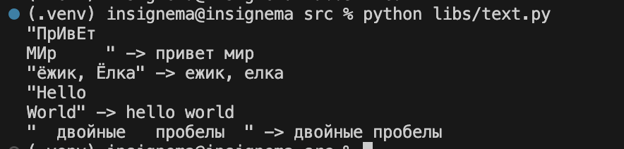
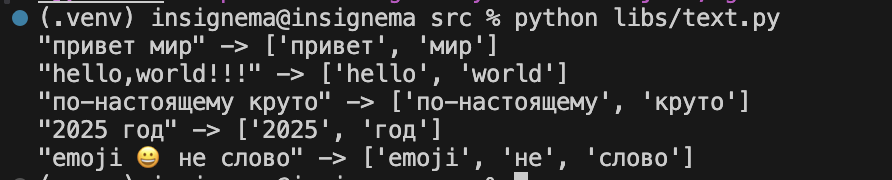
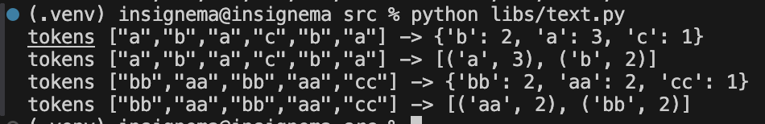
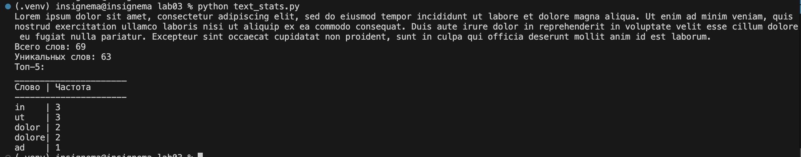

# python_labs

## Лабораторная работа 3

### Задание Normalize
```python
def normalize(text: str, *, casefold: bool = True, yo2e: bool = True) -> str:
    res_string = text.replace('\\t', " ").replace('\\r', " ").replace('\\f', " ")
    if casefold:
        res_string = text.casefold()
    if yo2e:
        res_string = res_string.replace('ё', 'е')
        res_string = res_string.replace('Ё', 'Е')

    words = res_string.split()
    res_string = ''
    for i in words:
        res_string += i + " "
    res_string = res_string.strip()
    return res_string
assert normalize("ПрИвЕт\nМИр\t") == "привет мир"
assert normalize("ёжик, Ёлка") == "ежик, елка"
```


### Задание Tokenize
```python
def tokenize(text: str) -> list[str]:
    return findall(r'\w+(?:-\w+)*', text)
assert tokenize("привет, мир!") == ["привет", "мир"]
assert tokenize("по-настоящему круто") == ["по-настоящему", "круто"]
assert tokenize("2025 год") == ["2025", "год"]
```


### Задание count_freq + top_n
```python
def count_freq(data):
    new_data = []
    new_data = set(data)
    dict = {}
    for i in new_data:
        col = data.count(i)
        dict[i] = col
    return dict

def top_n(dict, n_top):
    text = []
    for key, value in dict.items():
        text.append((key, value))
    ans = text.sort()
    ans = sorted(text, key = lambda x: (x[1]), reverse=True)
    res = []
    if n_top > len(dict):
        for i in range(len(dict)):
            res.append(ans[i])
    else:
        for i in range(n_top):
            res.append(ans[i])
    return res

# count_freq + top_n
freq = count_freq(["a","b","a","c","b","a"])
assert freq == {"a":3, "b":2, "c":1}
assert top_n(freq, 2) == [("a",3), ("b",2)]

# тай-брейк по слову при равной частоте
freq2 = count_freq(["bb","aa","bb","aa","cc"])
assert top_n(freq2, 2) == [("aa",2), ("bb",2)]
```


### Задание text_stats
```python
import sys, os
project_root = os.path.dirname(os.path.dirname(os.path.dirname(os.path.abspath(__file__))))
sys.path.insert(0, project_root)
from src.libs.text import *
s = input()
tokens = tokenize(normalize(s, casefold=True, yo2e=True))
freq = count_freq(tokens)
print(f"Всего слов: {len(tokens)}")
print(f"Уникальных слов: {len(freq)}")
top = top_n(freq, 5)
print('Топ-5:')
print("______________________")
leng = 0
for r, t in top:
    leng = max(leng, len(r))
print(f"Слово{" " * leng}| Частота")
print("----------------------")
for x, y in top:
    print(f"{x}{" " * (leng - len(x) + 1)}| {y}") 
```

