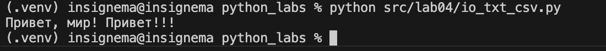
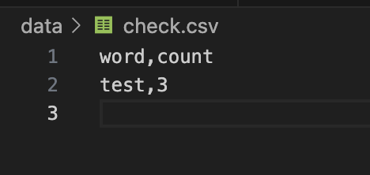
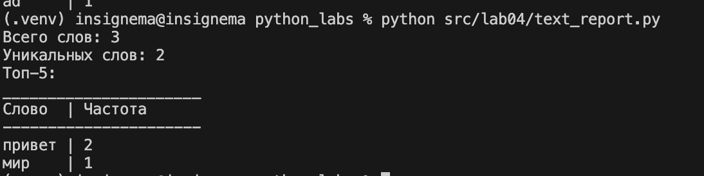
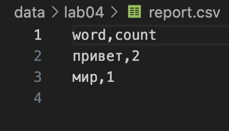
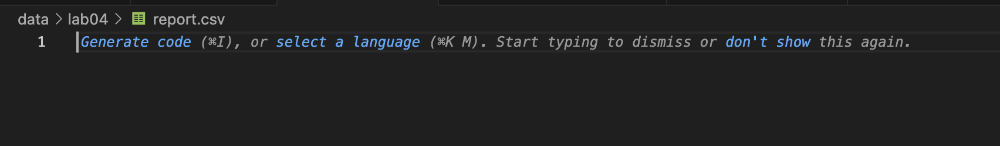

# python_labs

## Лабораторная работа 3

### Задание io_text_csv.py
```python
import csv
from pathlib import Path, PosixPath, WindowsPath
from typing import Iterable, Sequence
def read_text(path: str | Path, encoding: str = "utf-8") -> str:
    if type(path) not in [str, PosixPath, WindowsPath]:
        raise TypeError
    if not encoding == "utf-8":
        raise UnicodeDecodeError
    if not Path(path).exists():
        raise FileNotFoundError 
    return Path(path).read_text(encoding) 

def write_csv(rows: Iterable[Sequence], path: str | Path,
              header: tuple[str, ...] | None = None) -> None:
    if (not rows):
        file = Path(path).open("w", newline="", encoding="utf-8")
        if header == None:
            csv.writer(file).writerow(header)
            file.close()
    else:
        with open(path, mode='w', newline='', encoding='utf-8') as file:
            for j in range(len(rows) - 1):
                if len(rows[j]) != len(rows[j+1]):
                    raise ValueError
            write = csv.writer(file)
            if header is not None:
                write.writerow(header)
            for r in rows: 
                write.writerow(r)
```



### Задание text_report.py
```python
import sys
import os
from pathlib import Path
project_root = os.path.dirname(os.path.dirname(os.path.dirname(os.path.abspath(__file__))))
sys.path.insert(0, project_root)
from io_txt_csv import write_csv
from src.libs import text
path_in = "././data/lab04/input.txt"
path_a = "././data/lab04/a.txt"
path_b = "././data/lab04/b.txt"
# path_file = input() # - allows free file path input
if not Path(path_in).exists():
    raise FileNotFoundError

with open(path_in, mode="r", newline='', encoding='utf-8') as f:
    string = f.read()
    top = 5
    txt = text.top_n(text.count_freq(text.tokenize(text.normalize(string, casefold=True, yo2e=True))), 5)
    words = []
    for item in txt:
        words.append(item)
    write_csv(words, "././data/lab04/report.csv", ("word", "count"))
    print(f"Всего слов: {len(string.split())}")
    print(f"Уникальных слов: {len(txt)}")
    print('Топ-5:')
    print("______________________") 
    max_len = 5
    for r, t in txt: 
        max_len = max(max_len, len(r))
    print(f"Слово{" " * (max_len - 4)}| Частота")
    print("----------------------")
    for x, y in txt:
        print(f"{x}{" " * (max_len - len(x) + 1)}| {y}")
```


### Пустой input.txt


