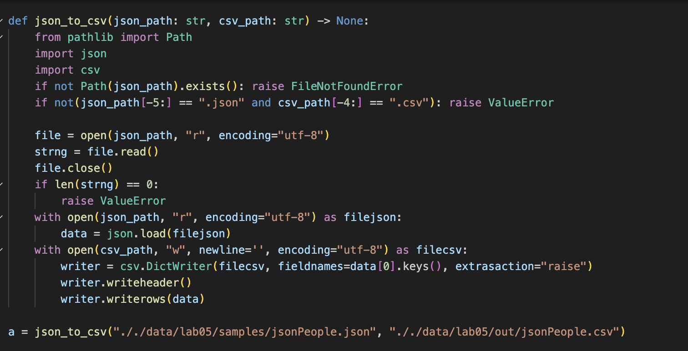
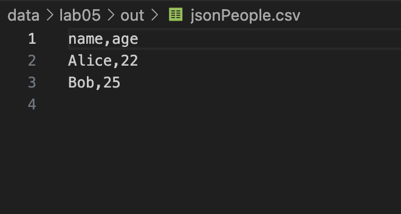
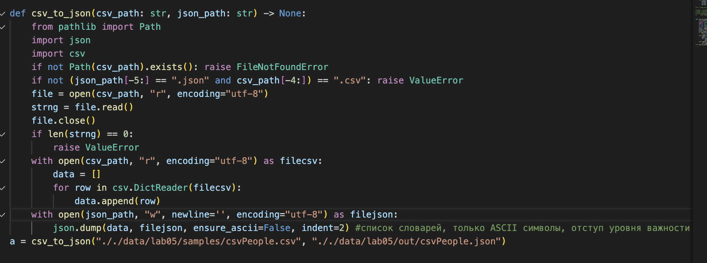
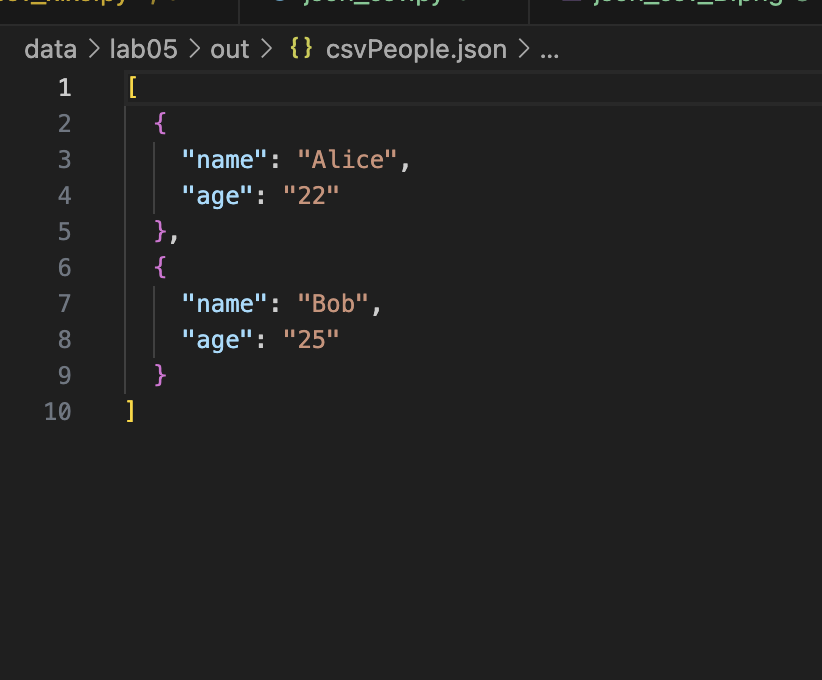
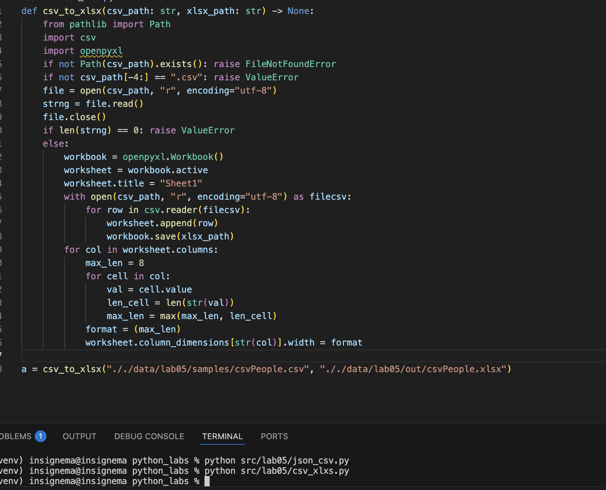
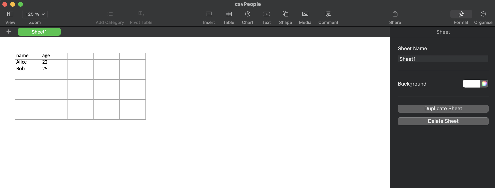

# python_labs

## **Задание A**
### Код задания №1
```python
def json_to_csv(json_path: str, csv_path: str) -> None:
    from pathlib import Path
    import json
    import csv
    if not Path(json_path).exists(): raise FileNotFoundError
    if not(json_path[-5:] == ".json" and csv_path[-4:] == ".csv"): raise ValueError

    file = open(json_path, "r", encoding="utf-8")
    strng = file.read()
    file.close()
    if len(strng) == 0:
        raise ValueError 
    with open(json_path, "r", encoding="utf-8") as filejson:
        data = json.load(filejson)
    with open(csv_path, "w", newline='', encoding="utf-8") as filecsv:
        writer = csv.DictWriter(filecsv, fieldnames=data[0].keys(), extrasaction="raise")
        writer.writeheader()
        writer.writerows(data)
```
### Скриншот задания №1

### Скриншот записанного файла

### Код задания №2
```python
def csv_to_json(csv_path: str, json_path: str) -> None:
    from pathlib import Path
    import json
    import csv
    if not Path(csv_path).exists(): raise FileNotFoundError 
    if not (json_path[-5:] == ".json" and csv_path[-4:]) == ".csv": raise ValueError
    file = open(csv_path, "r", encoding="utf-8")
    strng = file.read()
    file.close()
    if len(strng) == 0:
        raise ValueError 
    with open(csv_path, "r", encoding="utf-8") as filecsv:
        data = []
        for row in csv.DictReader(filecsv):
            data.append(row)
    with open(json_path, "w", newline='', encoding="utf-8") as filejson:
        json.dump(data, filejson, ensure_ascii=False, indent=2) #список словарей, только ASCII символы, отступ уровня важности 2
```
### Скриншот задания №2

### Скриншот записанного файла

## **Задание B**
### Код задания B
```python
def csv_to_xlsx(csv_path: str, xlsx_path: str) -> None:
    from pathlib import Path
    import csv
    import openpyxl
    if not Path(csv_path).exists(): raise FileNotFoundError
    if not csv_path[-4:] == ".csv": raise ValueError
    file = open(csv_path, "r", encoding="utf-8")
    strng = file.read()
    file.close()
    if len(strng) == 0: raise ValueError
    else:
        workbook = openpyxl.Workbook()
        worksheet = workbook.active 
        worksheet.title = "Sheet1" 
        with open(csv_path, "r", encoding="utf-8") as filecsv:
            for row in csv.reader(filecsv):
                worksheet.append(row)
                workbook.save(xlsx_path)
        for col in worksheet.columns:
            max_len = 8 
            for cell in col: 
                val = cell.value 
                len_cell = len(str(val)) 
                max_len = max(max_len, len_cell) 
            format = (max_len) 
            worksheet.column_dimensions[str(col)].width = format 
```
### Скриншот задания B

### Скриншот записанного файла
