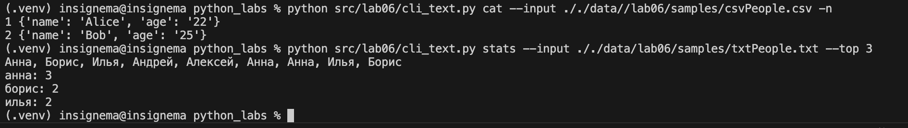
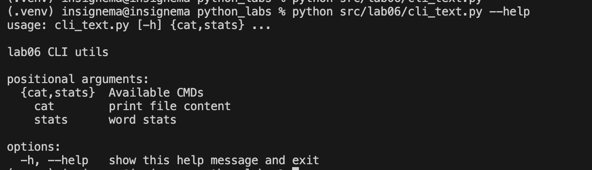
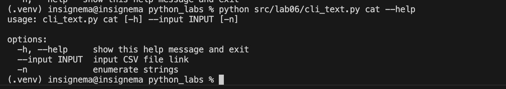
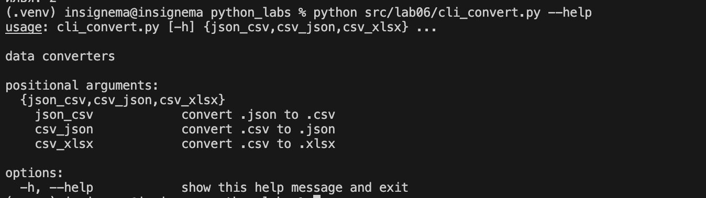

# python_labs

## **Задание A**

```python
import argparse

def main():
    parser = argparse.ArgumentParser(description="lab06 CLI utils") # --help
    subparsers = parser.add_subparsers(dest="command", help="Available CMDs") # subparsers
    # cat subcommand
    cat_parser = subparsers.add_parser("cat", help="print file content") # cat
    cat_parser.add_argument("--input", required=True, help="input CSV file link") # --input
    cat_parser.add_argument("-n", action="store_true", help="enumerate strings") # -n
    # stats subcommand
    stats_parser = subparsers.add_parser("stats", help="word stats") # stats
    stats_parser.add_argument("--input", required=True, help="txt file link") # --input
    stats_parser.add_argument("--top", type=int, default=5, help="set top") # -top
    
    args = parser.parse_args() # get attribute and write into args

    if args.command == "cat":
        csv_path = args.input 
        from pathlib import Path
        import csv

        if not Path(csv_path).exists(): raise ValueError 
        if not csv_path[-4:] == ".csv": raise FileNotFoundError 

        file = open(csv_path, "r", encoding="utf-8")
        strng = file.read()
        file.close()
        if len(strng) == 0: raise ValueError 

        with open(csv_path, "r", encoding="utf-8") as filecsv: 
            reader = csv.DictReader(filecsv) 
            counts = 1
            if args.n == True: # if enumerate
                for row in reader:
                    print(f"{counts} {row}")
                    counts += 1
            else: 
                for row in reader:
                    print(row)

        
    elif args.command == "stats": #if stats cmd
        txt_path = args.input 
        from pathlib import Path
        import sys
        import os
        project_root = os.path.dirname(os.path.dirname(os.path.dirname(os.path.abspath(__file__))))
        sys.path.insert(0, project_root) 
        import src.libs.text as text # normalize, tokenize, count_freq, top_n
        if not Path(txt_path).exists(): raise FileNotFoundError
        if not txt_path[-4:] == ".txt": raise ValueError
        file = open(txt_path, "r", encoding="utf-8")
        strng = file.read()
        file.close()
        if len(strng) == 0: raise ValueError
        with open(txt_path, "r", encoding="utf-8") as filetxt: 
            strngs = filetxt.read()
            strngs = str(strngs)
            print(strngs)
            top_n = args.top 
            ans = text.normalize(strngs, casefold=True, yo2e=True)
            ans = text.tokenize(ans) 
            ans = text.count_freq(ans) 
            ans = text.top_n(ans, top_n) 
            for x, y in ans: 
                print(f"{x}: {y}")


b = main() 

# python src/lab06/cli_text.py --help
# python src/lab06/cli_text.py cat --help
# python src/lab06/cli_text.py cat --input ././data//lab06/samples/csvPeople.csv -n
# python src/lab06/cli_text.py stats --input ././data/lab06/samples/txtPeople.txt --top 3
```
### Скриншот задания №1, №2

### Скриншот --help 

### Скриншот выполнения команды cat --help

## **Задание Б**
### Код задания Б
```python
import argparse
import sys
import os
project_root = os.path.dirname(os.path.dirname(os.path.dirname(os.path.abspath(__file__))))
sys.path.insert(0, project_root)
from src.lab05.json_csv import *
from src.lab05.csv_xlxs import *

def main():
    parser = argparse.ArgumentParser(description="data converters")
    sub = parser.add_subparsers(dest="cmd")

    jscsv = sub.add_parser("json_csv", help="convert .json to .csv")
    jscsv.add_argument("--input", dest="input", required=True, help="json file link")
    jscsv.add_argument("--output", dest="output", required=True, help="csv file link")

    csvjs = sub.add_parser("csv_json", help="convert .csv to .json")
    csvjs.add_argument("--input", dest="input", required=True, help="csv file link")
    csvjs.add_argument("--output", dest="output", required=True, help="json file link")

    csvxl = sub.add_parser("csv_xlsx", help="convert .csv to .xlsx")
    csvxl.add_argument("--input", dest="input", required=True, help="csv file link")
    csvxl.add_argument("--output", dest="output", required=True, help="xlsx file link")

    args = parser.parse_args()

    if args.cmd == "json_csv":
        answer = json_to_csv(args.input, args.output)

    elif args.cmd == "csv_json":
        answer = csv_to_json(args.input, args.output) 

    elif args.cmd == "csv_xlsx":
        answer = csv_to_xlsx(args.input, args.output)

d = main()

# CMD EXAMPLES
# python src/lab06/cli_convert.py json_csv --input ././data/lab06/samples/jsonPeople.json --output ././data/lab06/out/json_csv.csv
# python src/lab06/cli_convert.py csv_json --input ././data/samples/csvPeople.csv --output ././data/lab06/out/csv_json.json
# python src/lab06/cli_convert.py csv_xlsx --input ././data/samples/csvPeople.csv --output ././data/lab06/out/csv_xlsx.xlsx
```
### Скриншот выполнения команды --help задания Б
