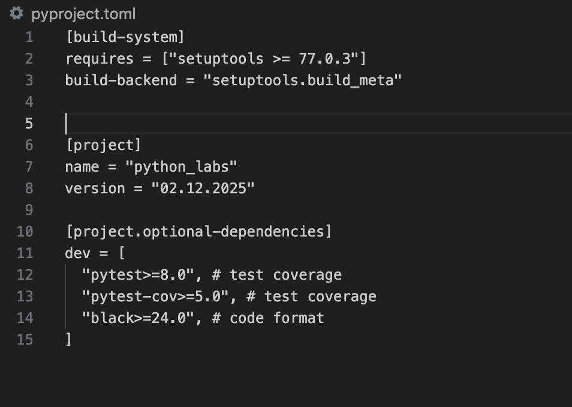
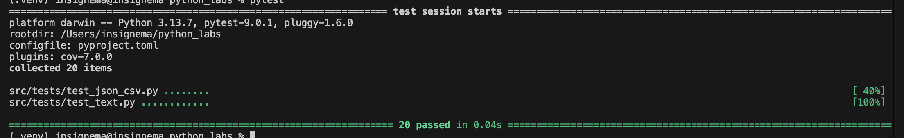
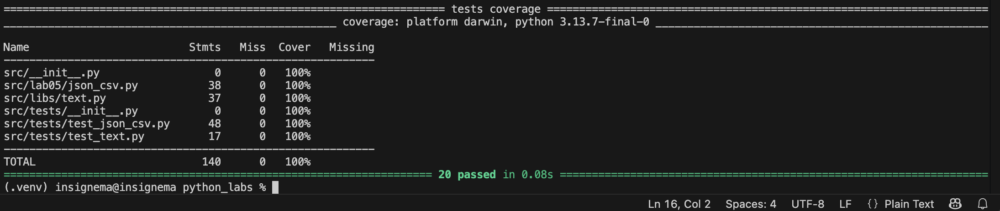
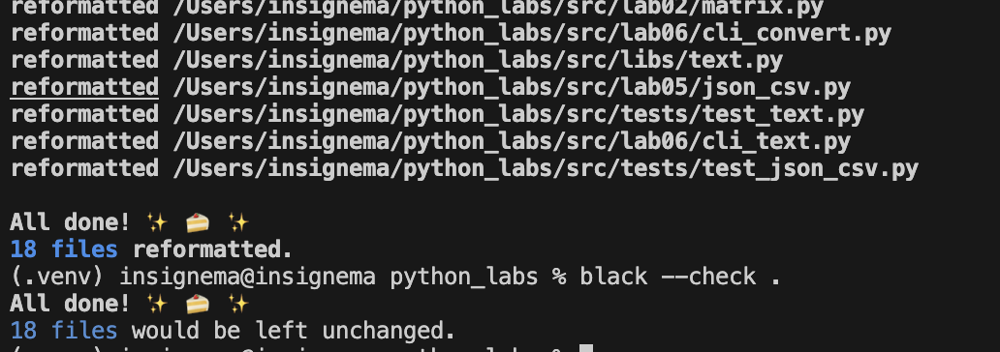

# python_labs

## pyproject.toml

## **Задание A**
### Код задания A
```python
import pytest  # type: ignore
import sys
import os

sys.path.insert(
    0, os.path.dirname(os.path.dirname(os.path.dirname(os.path.abspath(__file__))))
)
from src.libs.text import normalize, tokenize, count_freq, top_n


@pytest.mark.parametrize(
    "source, expected",
    [
        ("ПрИвЕт \nМИр \t", "привет мир"),
        ("ёжик, Ёлка", "ежик, елка"),
        ("Hello \r \nWorld", "hello world"),
        ("  двойные   пробелы  ", "двойные пробелы"),
    ],
)
def test_normalize_basic(source, expected):
    assert normalize(source, casefold=True, yo2e=True) == expected


@pytest.mark.parametrize(
    "source, expected",
    [
        ("hello,world!!!", ["hello", "world"]),
        ("это по-настоящему круто", ["это", "по-настоящему", "круто"]),
        ("2025 год", ["2025", "год"]),
        ("emoji 😀 не слово", ["emoji", "не", "слово"]),
    ],
)
def test_tokenize_basic(source, expected):
    assert tokenize(source) == expected


@pytest.mark.parametrize(
    "source, expected",
    [
        (["a", "b", "a", "c", "b", "a"], {"a": 3, "b": 2, "c": 1}),
        (["bb", "aa", "bb", "aa", "cc"], {"aa": 2, "bb": 2, "cc": 1}),
    ],
)
def test_count_freq_and_top_n(source, expected):
    assert count_freq(source) == expected


@pytest.mark.parametrize(
    "source, top, expected",
    [
        ({"a": 3, "b": 2, "c": 1}, 2, [("a", 3), ("b", 2)]),
        ({"aa": 2, "bb": 2, "cc": 1}, 5, [("aa", 2), ("bb", 2), ("cc", 1)]),
    ],
)
def test_top_n_tie_breaker(source, top, expected):
    assert top_n(source, top) == expected
```

## **Задание Б**
### Код задания Б
```python
import pytest  # type: ignore
import sys
import os

sys.path.insert(
    0, os.path.dirname(os.path.dirname(os.path.dirname(os.path.abspath(__file__))))
)
from src.lab05.json_csv import json_to_csv, csv_to_json


# json_csv test
@pytest.mark.parametrize(
    "path_in, path_out, expected",
    [
        (
            "././data/tests/samples/people.json",
            "././data/tests/out/people07.csv",
            None,
        ),
        (
            "././data/tests/samples/empty07.json",
            "././data/tests/out/empty07.csv",
            ValueError,
        ),  # empty file
        (
            "././data/tests/samples/no_file07.json",
            "././data/tests/out/no_file07.csv",
            FileNotFoundError,
        ),  # no file
    ],
)
def test_json_to_csv_basic(path_in, path_out, expected):
    if expected is None:  # if expected behavior is correct
        assert json_to_csv(path_in, path_out) == expected
    else:
        with pytest.raises(expected):
            json_to_csv(path_in, path_out)


# csv_json test
@pytest.mark.parametrize(
    "path_in, path_out, expected",
    [
        (
            "././data/tests/samples/people.csv",
            "././data/tests/out/people07.json",
            None,
        ),
        (
            "././data/tests/samples/empty07.csv",
            "././data/tests/out/empty07.json",
            ValueError,
        ),  # empty file
        (
            "././data/tests/samples/no_file07.csv",
            "././data/tests/out/no_file07.json",
            FileNotFoundError,
        ),  # no file
    ],
)
def test_csv_to_json_basic(path_in, path_out, expected):
    if expected is None:  # if expected behavior is correct
        assert csv_to_json(path_in, path_out) == expected
    else:
        with pytest.raises(expected):
            csv_to_json(path_in, path_out)


import json
import csv
from pathlib import Path


def test_json_to_csv_roundtrip(tmp_path: Path):
    src = tmp_path / "people.json"
    dst = tmp_path / "people.csv"
    data = [
        {"name": "Alice", "age": 22},
        {"name": "Bob", "age": 25},
    ]
    src.write_text(json.dumps(data, ensure_ascii=False, indent=2), encoding="utf-8")
    json_to_csv(str(src), str(dst))

    with dst.open(encoding="utf-8") as f:
        rows = list(csv.DictReader(f))

    assert len(rows) == 2
    assert {"name", "age"} <= set(rows[0].keys())


def test_csv_to_json_roundtrip(tmp_path: Path):
    src = tmp_path / "people.csv"
    dst = tmp_path / "people.json"
    data = [
        {"name": "Alice", "age": 22},
        {"name": "Bob", "age": 25},
    ]
    initorder = data[0].keys()
    with src.open("w", encoding="utf-8") as filecsv:
        writer = csv.DictWriter(filecsv, fieldnames=initorder, extrasaction="raise")
        writer.writeheader()
        writer.writerows(data)
    with src.open("r", encoding="utf-8") as filecsv:
        reader = csv.DictReader(filecsv)
        data = []
        for row in reader:
            data.append(row)
    with dst.open("w", newline="", encoding="utf-8") as filejson:
        json.dump(data, filejson, ensure_ascii=False, indent=2)

    assert len(data) == 2
    assert {"name", "age"} <= set(data[0].keys())
```
### tests functional

### Проверка покрытия Б1

### Проведение быстрого теста задания Б2

## **Проверка на соответствие black**
