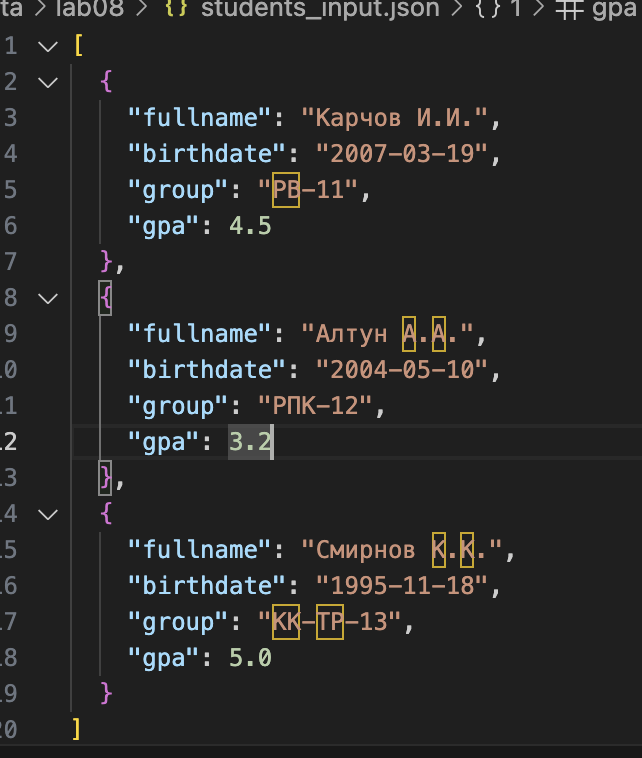
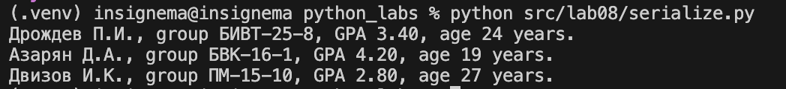

# python_labs

## **models.py**
### Код models.py
```python
from dataclasses import dataclass
from datetime import *


@dataclass # generates class methods automatically
class Student:
    name: str
    birthdate: str
    group: str
    gpa: float

    def __post_init__(self):
        try: 
            dt_obj = datetime.strptime(self.birthdate, "%Y-%m-%d").date()
        except ValueError as exception:
            raise ValueError(f"Date format error: {self.birthdate}: must be 'YYYY-MM-DD'") from exception
            
        if not (0 <= self.gpa <= 5):
            raise ValueError("Grade point average must be between 0 and 5.")
    
    def age(self) -> int: 
        birthday = datetime.strptime(self.birthdate, "%Y-%m-%d").date() 
        today = date.today()
        return today.year - birthday.year - int((today.month, today.day) < (birthday.month, birthday.day)) 

    def to_dict(self) -> dict:
        return {
            "name": self.name,
            "birthdate": self.birthdate,
            "group": self.group,
            "gpa": self.gpa
        }

    @classmethod
    def from_dict(cls, data: dict):
        return cls(
            name=data["name"],
            birthdate=data["birthdate"],
            group=data["group"],
            gpa=float(data["gpa"])
        )

    def __str__(self):
        return f"{self.name}, group {self.group}, GPA {self.gpa:.2f}, age {self.age()} years."
```

## **serialize**
### Код serialize.py
```python
import json
from typing import List
from models import Student


def students_to_json(students: List[Student], path: str):
    with open(path, "w", encoding="utf-8") as file: 
        data = [] 
        for student in students:
            data.append(student.to_dict())
        json.dump(data, file, ensure_ascii=False, indent=2) 


def students_from_json(path: str) -> List[Student]:
    with open(path, "r", encoding="utf-8") as file: 
        data = json.load(file)
        student_list = []
        for i in data:
            student_list.append(Student.from_dict(i))
        return student_list

if __name__ == "__main__":
    students_list = [
        Student(fio="Карчов И.И.", birthdate="2007-03-19", group="РВ-11", gpa=4.5),
        Student(fio="Алтун А.А.", birthdate="2004-05-10", group="РПК-12", gpa=3.2),
        Student(fio="Смирнов К.К.", birthdate="1995-11-18", group="КК-ТР-13", gpa=5.0)
    ]

    students_to_json(students_list, "./data/lab08/students_input.json")

    loaded_students = students_from_json("./data/lab08/students_output.json")

    for students in loaded_students: 
        print(students)
```

### students_input

### students_output
