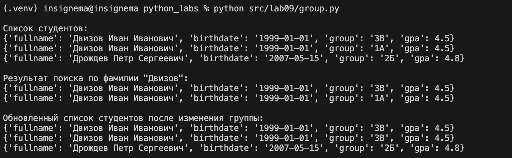
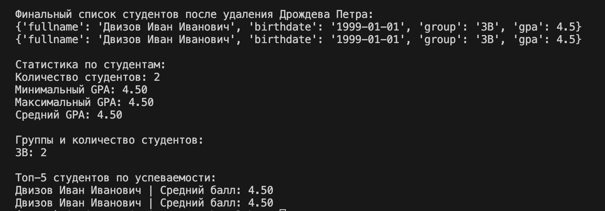

# python_labs

## **group**
### Код group
```python
import csv
from typing import List, Dict
from pathlib import Path
import sys
import os
project_root = os.path.dirname(
    os.path.dirname(os.path.dirname(os.path.abspath(__file__)))
)
sys.path.insert(0, project_root)
from src.lab08.models import Student


class Group:
    def __init__(self, storage_path: str):
        self.path = Path(storage_path)
        if not self.path.exists():
            with open(self.path, 'w', newline='', encoding='utf-8') as file:
                writer = csv.writer(file)
                writer.writerow(['fullname', 'birthdate', 'group', 'gpa'])
    
    def _read_all(self) -> List[Dict[str, str]]:
        result = []
        try:
            with open(self.path, mode='r', encoding='utf-8') as file:
                reader = csv.DictReader(file) # Читаем все записи
                for row in reader:
                    result.append(row)
        except FileNotFoundError:
            raise FileNotFoundError
        return result
    
    def list(self) -> List[Student]:
        students = []
        rows = self._read_all()
        for row in rows:
            students.append(
                Student(fullname=row['fullname'], birthdate=row['birthdate'], group=row['group'], gpa=float(row['gpa']))
            )
        return students

    def add(self, student: Student):
        current_data = self._read_all()

        current_data.append({
            'fullname': student.fullname,
            'birthdate': student.birthdate,
            'group': student.group,
            'gpa': student.gpa
        })
        with open(self.path, mode='w', newline='', encoding='utf-8') as file:
            writer = csv.writer(file)
            writer.writerow(['fullname', 'birthdate', 'group', 'gpa'])  # заголовочная строка
            writer.writerows([
                [row['fullname'], row['birthdate'], row['group'], row['gpa']]
                for row in current_data
            ])

    def find(self, substr: str) -> List[Student]:

        found_students = []
        rows = self._read_all() 
        for row in rows:
            if substr.lower() in row['fullname'].lower(): # if theres a match
                found_students.append(
                    Student(fullname=row['fullname'], birthdate=row['birthdate'], group=row['group'], gpa=float(row['gpa']))
                )
        return found_students

    def remove(self, fullname: str):
        rows = self._read_all()
        updated_rows = [row for row in rows if row['fullname'] != fullname]
        with open(self.path, mode='w', newline='', encoding='utf-8') as file:
            writer = csv.writer(file)
            if updated_rows:
                writer.writerow(['fullname', 'birthdate', 'group', 'gpa'])  # header
            writer.writerows([[r['fullname'], r['birthdate'], r['group'], r['gpa']] for r in updated_rows])

    def update(self, fullname: str, **fields):
        rows = self._read_all()
        updated_rows = []
        for row in rows:
            if row['fullname'] == fullname:
                for key, value in fields.items():
                    row[key] = value
            updated_rows.append(row)
        with open(self.path, mode='w', newline='', encoding='utf-8') as file:
            writer = csv.writer(file)
            if updated_rows: 
                writer.writerow(['fullname', 'birthdate', 'group', 'gpa'])  # header
            writer.writerows([[r['fullname'], r['birthdate'], r['group'], r['gpa']] for r in updated_rows])
        
    def stats(self) -> dict:
        data = self._read_all()
        count = len(data)
        
        # min and max GPAs
        gpas = [float(student['gpa']) for student in data]
        min_gpa = min(gpas) if gpas else None
        max_gpa = max(gpas) if gpas else None
        avg_gpa = sum(gpas) / len(gpas) if gpas else None
        
        groups_count = {}
        for student in data:
            group_name = student['group']
            groups_count[group_name] = groups_count.get(group_name, 0) + 1
        
        # top-5 students based on gpa
        top_students = sorted(data, key=lambda x: float(x['gpa']), reverse=True)[:5]
        top_5_students = [{
            "fullname": student["fullname"],
            "gpa": float(student["gpa"])
        } for student in top_students]
        
        return {
            "count": count,
            "min_gpa": min_gpa,
            "max_gpa": max_gpa,
            "avg_gpa": avg_gpa,
            "groups": groups_count,
            "top_5_students": top_5_students
        }

if __name__ == "__main__":
    group_storage = './data/lab09/students.csv'
    my_group = Group(group_storage)

    # .add method test
    new_student_1 = Student("Двизов Иван Иванович", "1999-01-01", "1А", 4.5)
    new_student_2 = Student("Дрождев Петр Сергеевич", "2007-05-15", "2Б", 4.8)
    my_group.add(new_student_1)
    my_group.add(new_student_2)

    # .list method test
    print("\nСписок студентов:")
    all_students = my_group.list()
    for st in all_students:
        print(st.__dict__)

    # .find method test
    search_result = my_group.find("Двизов")
    print("\nРезультат поиска по фамилии \"Двизов\":")
    for st in search_result:
        print(st.__dict__)

    # .update method test
    my_group.update("Двизов Иван Иванович", group="3В")

    # print again
    print("\nОбновленный список студентов после изменения группы:")
    updated_students = my_group.list()
    for st in updated_students:
        print(st.__dict__)

    # .remove method test
    my_group.remove("Дрождев Петр Сергеевич")

    # print to check functional
    print("\nФинальный список студентов после удаления Дрождева Петра:")
    final_students = my_group.list()
    for st in final_students:
        print(st.__dict__)
    
    # general test
    print("\nСтатистика по студентам:")
    my_group = Group('./data/lab09/students.csv')
    result_stats = my_group.stats()

    print(f"Количество студентов: {result_stats['count']}")
    print(f"Минимальный GPA: {result_stats['min_gpa']:.2f}")
    print(f"Максимальный GPA: {result_stats['max_gpa']:.2f}")
    print(f"Средний GPA: {result_stats['avg_gpa']:.2f}\n")

    print("Группы и количество студентов:")
    for group, count in result_stats['groups'].items():
        print(f"{group}: {count}")

    print("\nТоп-5 студентов по успеваемости:")
    for student in result_stats['top_5_students']:
        print(f"{student['fullname']} | Средний балл: {student['gpa']:.2f}")
```
### Результат проверки функционала


