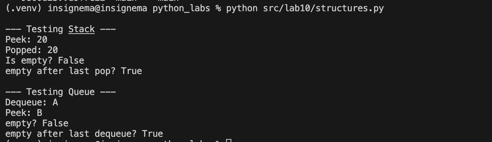

# python_labs

## **structures**
### Код structures
```python
from collections import deque

class Stack:
    def __init__(self):
        self._data = []  # internal storage

    def push(self, item):
        self._data.append(item)

    def pop(self):
        if self.is_empty():
            raise IndexError("stack is empty")
        return self._data.pop()

    def peek(self):
        if self.is_empty():
            return None  # none if empty
        return self._data[-1]

    def is_empty(self) -> bool:
        return len(self._data) == 0


class Queue:
    def __init__(self):
        self._data = deque()  

    def enqueue(self, item):
        self._data.append(item)

    def dequeue(self):
        if self.is_empty():
            raise IndexError("empty queue")  # if you try to dequeue from empty
        return self._data.popleft() 

    def peek(self):
        if self.is_empty():  
            return None  # none if the queue is empty
        return self._data[0]

    def is_empty(self) -> bool:
        return len(self._data) == 0 
stack = Stack()
print("\n--- Testing Stack ---")
stack.push(10)
stack.push(20)
print("peek:", stack.peek())  # expected: Peek: 20
item = stack.pop()
print("popped:", item)       # expected: Popped: 20
print("empty?", stack.is_empty())   # expected: empty? False
stack.pop()
print("empty after last pop?", stack.is_empty())   # expected: Is empty after last pop? True

queue = Queue()
print("\n--- Testing Queue ---")
queue.enqueue('1')
queue.enqueue('2')
print("dequeue:", queue.dequeue())     # expected: Dequeue: 1
print("peek:", queue.peek())           # expected: Peek: 2
print("empty?", queue.is_empty())   # expected: empty? False
queue.dequeue()
print("empty after last dequeue?", queue.is_empty())   # expected: empty after last dequeue? True
```

### structures



## **linked_list**
### Код linked_list
```python
class Node: # nodes of a linked list
    def __init__(self, value, next=None):
        self.value = value  # current node
        self.next = next  # ptr to next node

    # 
    def __repr__(self):  # representation of a seperate node
        return f"[{self.value}]"


class SinglyLinkedList:
    def __init__(self):
        self.head = None # start of a linked list
        self._size = 0

    def append(self, value):
        new_node = Node(value) 
        if self.head is None:
            self.head = new_node 
        else:
            current = self.head 
            while current.next is not None: 
                current = current.next
            current.next = new_node 
        self._size += 1 

    def prepend(self, value):
        new_node = Node(value, next=self.head) 
        self.head = new_node 
        self._size += 1  

    def insert(self, idx, value):
        if idx < 0 or idx > self._size: # validity check
            raise IndexError(f"Incorrect index {idx}")
            
        if idx == 0:
            self.prepend(value)
            return
        
        current = self.head 
        position = 0
        while current and position < idx - 1:
            current = current.next
            position += 1
        
        new_node = Node(value, next=current.next) 
        current.next = new_node 
        self._size += 1

    def remove_value(self, value):
        if self.head is None: 
            return
        
        if self.head.value == value:
            self.head = self.head.next 
            self._size -= 1
            return
        
        prev = None
        current = self.head
        while current is not None: 
            if current.value == value: 
                prev.next = current.next
                self._size -= 1
                break
            prev = current
            current = current.next

    def remove_at(self, idx):
        if idx < 0 or idx >= self._size: # validity check
            raise IndexError(f"Index {idx} goes beyond list limits.")
        
        if idx == 0: # if we remove the first elem
            self.head = self.head.next
            self._size -= 1
            return
        
        prev = None
        current = self.head 
        position = 0 
        while current and position < idx: 
            prev = current
            current = current.next
            position += 1
        
        prev.next = current.next # current node!
        self._size -= 1 

    def __iter__(self):
        current = self.head 
        while current is not None: 
            yield current.value 
            current = current.next 

    def __len__(self):
        return self._size  # amount of elements in the list

    def __repr__(self):
        nodes = []
        current = self.head
        while current is not None:
            nodes.append(str(current))
            current = current.next
        return " -> ".join(nodes + ["None"])
    


sll = SinglyLinkedList()
print("\n--- Testing Singly Linked List ---")
sll.append(1)
sll.prepend(2)
sll.insert(1, 3)
print("Current state of the list:", sll)      # expected: Current state of the list: SinglyLinkedList([2, 3, 1])
sll.remove_value(3)
print("After removing value 3:", sll)         # expected: After removing value 3: SinglyLinkedList([2, 1])
sll.remove_at(0)
print("After removing at index 0:", sll)      # expected: After removing at index 0: SinglyLinkedList([1])
print("Length of the list:", len(sll))        # expected: Length of the list: 1


sll = SinglyLinkedList()
sll.append('A')
sll.append('B')
sll.append('C')
print(sll)  # expected: [A] [B] [C] -> None
```

### fancy

